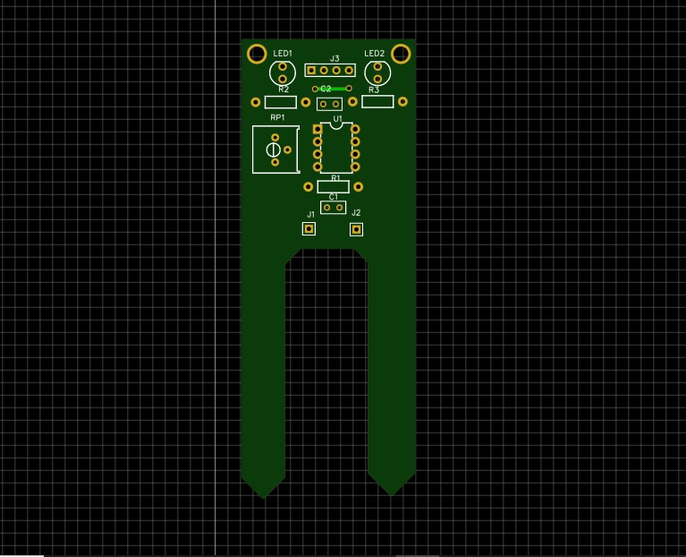
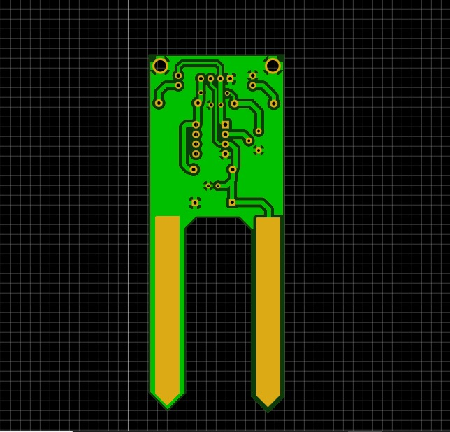

# PCB Design Project – Soil Moisture Sensor

## 📌 Overview
This project is a **PCB design for a Soil Moisture Sensor** using EasyEDA.  
The circuit is based on the LM358 operational amplifier, which compares the soil resistance (moisture level) and provides both analog and digital outputs. It also includes indicator LEDs to show the soil condition. The PCB layout was designed in EasyEDA, and fabrication-ready Gerber files are included.

## 🛠 Tools Used
- EasyEDA (schematic & PCB design)  

## 🔧 Features
- LM358-based comparator circuit  
- Soil probe connector interface  
- Provides **Analog Output (AOUT)** and **Digital Output (DOUT)**  
- Adjustable threshold using potentiometer (10k)  
- Indicator LEDs for soil wet/dry condition  
- Compact PCB layout for easy soil monitoring applications  

## 📂 Repository Structure
- **schematic/** → Soil moisture sensor schematic diagram (PDF/PNG)  
- **pcb_layout/** → PCB layout images  
- **gerber_files/** → Fabrication-ready files for PCB manufacturing  
- **source/** → EasyEDA project files  

## 🚀 How to Use
1. Open the project in **EasyEDA**.  
2. Review schematic and PCB layout.  
3. Export Gerber files for PCB fabrication.  
4. Assemble the PCB with LM358, resistors, capacitors, connectors, and LEDs.  
5. Connect soil probe to sensor pins → monitor AOUT (analog) and DOUT (digital).  

## 📸 Project Images
## Top-Layout :

## bottom-Layout :

## Top-3D-View :

## bottom-3D-View :

## 📄 License
This project is shared for educational and learning purposes.
